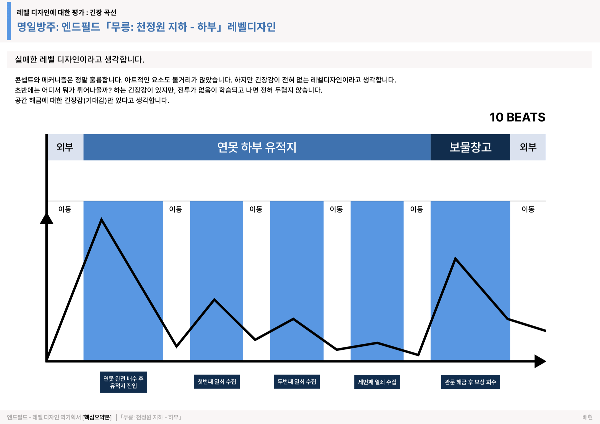
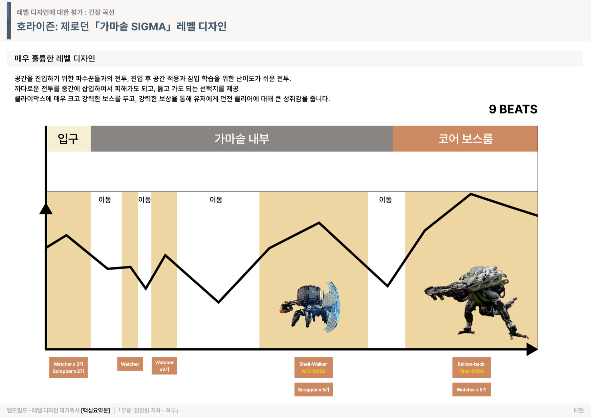
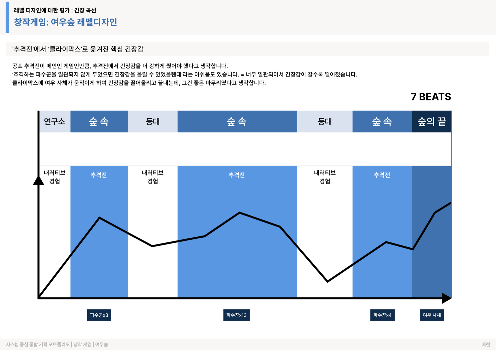
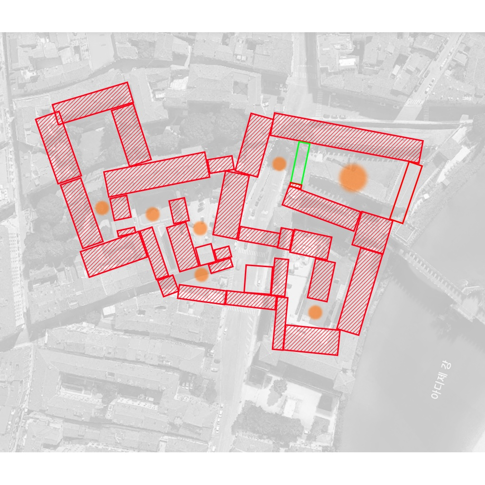
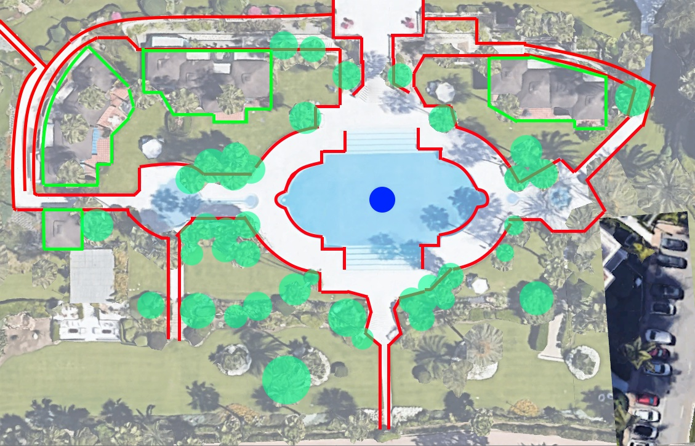

# 신규 영역 기획서 v3 — 언리얼 레벨 · 지금 하는 게임 · 긴장 곡선 부록 (작업 직전판)

> **상태: 작업 직전 단계 완료 (2026-07-19).** 기획 확정 + 에셋 스테이징 + 붙여넣기용 코드 초안(§7)까지 끝났다.
> **구현 = §7 코드를 지정 위치에 삽입 + §6 검증**뿐이다. 사용자 "구현해" 지시가 떨어지면 그대로 진행한다.
> v2 → v3: ① 평면도↔맵 **매칭 확정**(영상 썸네일 대조 — §1-1), ② 에셋 리포 내 스테이징 완료(§4), ③ 전 오픈 퀘스천 결정(§5), ④ 코드 초안 작성(§7).

## 0. 페이지 서사와 배치 (확정)

```
캐러셀 히어로 → #resume → #analysis → #projects
                                        └ ★③ 긴장 곡선 부록 밴드 (#tension, 섹션 내부)
→ ★① #unreal (언리얼 레벨)  → #links  → ★② #play (지금 하는 게임)  → 푸터
```

사이트 전체가 **분석 → 설계 → 구현 → 평가** 풀 사이클이 된다. 긴장 곡선(평가)이 기획서 5편 끝에 붙고,
바로 다음 #unreal이 설계(평면도)→구현(영상)을 보여주며, #play가 그 모든 것의 입구(플레이)로 마무리한다.

## 1. 영역① — 언리얼 레벨 (#unreal) : 확정 사항

### 1-1. 평면도↔맵 매칭 — **최종 (2026-07-19 사용자 교정 반영)**

> ⚠️ 최초 썸네일 소거법 매칭은 **틀렸다**(맵 개수를 2종으로 가정 → dungeon=map01로 오판). 실제 **3종**. 아래가 확정본.

| 맵 | 영상 | 설계물 | 상태 |
|---|---|---|---|
| **MAP 01 · 모작** | 「유명 FPS 맵 그대로 옮겨보기」 youtu.be/EQrjefizxbA | `plan-shipment.jpg` (UE 에디터 **MW_Shipment 블록아웃**) | 완성. Shipment = CoD:MW 유명 FPS 맵 → "유명 맵 모작"과 일치 |
| **MAP 02 · 창작** | 「현실 공간을 FPS 공간으로 바꿔보기」 youtu.be/CrrPiAUJFuY | `plan-pool.jpg` (리조트 풀 항공) | 완성. 썸네일 풀 블록아웃+미니맵과 일치 |
| **MAP 03 · 창작** | (없음 — 진행 중) | `plan-dungeon.jpg` (도심 항공 미로 구상도) | **진행 중**. 영상 자리에 `.umap-wip` 플레이스홀더 |

교훈: 썸네일 소거법은 **맵 개수 가정이 틀리면 통째로 무너진다**. dungeon 항공을 map01로 넣었던 게 오판의 뿌리. MW_Shipment 블록아웃(map01 실제 설계물)은 사용자가 별도 제공(`~/Downloads/언리얼에 사용_FPS 첫번째맵.png`).

### 1-2. 확정된 형태

- 제목: tag `ENGINE PROOF — UNREAL` / h2 **세 번째 엔진, 언리얼** (A안)
- 구성: 맵당 1카드, 내부 그리드 **평면도(PLAN — 설계, 5fr) → 영상(BUILD — 구현, 7fr)**, 모바일 세로 스택(설계→구현 순)
- 칩: MAP 01 `모작`(kind) + `문법 학습`(field) / MAP 02 `창작`(kind) + `공간 번역`(field) — 기존 2층 칩 문법 재사용
- 하단: 브릿지 문장 + 오픈월드 예고(`.ing` 진행 중 칩)
- 연결 4곳: 이력서 엔진 배지(Unreal Engine, `#unreal` 앵커) · FPS 자습 행 `제작 기록 ↓` · 목차 `언리얼 레벨`(7번째) · meta description 꼬리

## 2. 영역② — 지금 하는 게임 (#play) : 확정 사항

- 제목: tag `NOW PLAYING` / h2 **지금 하는 게임** + 우측 모노 캡션 `AS OF 2026.07.19` (A안)
- 카드 4장(준 순서): **트릭컬 리바이브** LV.38 · 전투력 314,407 / **니케** LV.209 · 전투력 258,433 / **블루 아카이브** LV.83 / **명조** LV.28 + `뉴비` 칩
- "그리고" 행: 리그 오브 레전드(11년 · 최고 플래티넘4) · 스타크래프트 1·2(스타1 1900점대) · TFT(최고 다이아2) · 펠월드 ·
  디트로이트 `리뷰 ↑` · 33 원정대 `리뷰 ↑` — 경쟁 게임 수치는 2026-01 「게임 플레이 이력」 문서 근거(현행화 검수 §5)
- 배치: #links 뒤, 푸터 앞. 목차 미포함. 게임 로고 이미지 금지(저작권·톤).

## 3. 영역③ — 긴장 곡선 부록 밴드 (#tension) : 확정 사항

- 위치: #projects 내부, 제안서 카드 그룹 바로 아래(`.cards--single` 닫는 `</div>` 뒤). 그룹 헤더 재사용, 배지 `부록 · PDF 3장`
- 카드 3장: 슬라이드 이미지(전부 1800×1272 동일 → 자연비 표시로 행 정렬) + 판정 + BEATS + 한 줄 논지 + 클릭 시 원본 새 탭
- **판정 워드 색: "실패"만 patch색**(다크용 `#E8674E`), 훌륭·아쉬움은 흰 배지. `.home`에 patch 토큰 추가 필요(§7-1)
- 여우숲 카드에 `자기 비판` 칩 — 정직함이 이 문서의 무기
- 하단: `PDF 전체 보기 ↗` + #unreal 브릿지(인과 아닌 병렬형 문안 — "재는 법을 알면 세우는 법이 보입니다")

## 4. 에셋 스테이징 — **완료** (리포에 반입됨)

| 파일 | 크기·치수 | 출처·처리 |
|---|---|---|
| `assets/img/unreal-level/plan-dungeon.jpg` | 319K · 1024×1024 | 다운로드 원본 PNG(1.4MB) → JPEG q85, **원본 해상도 유지**(업스케일 금지 확인) |
| `assets/img/unreal-level/plan-pool.jpg` | 335K · 1129×726 | 〃 (1.5MB → 335K) |
| `assets/img/tension/mureung.png` | 257K · 1800×1272 | PDF p2를 pymupdf 160dpi 렌더 → 1800px 리사이즈. 텍스트·곡선 선명(육안 확인) |
| `assets/img/tension/sigma.png` | 349K · 1800×1272 | 〃 p3 |
| `assets/img/tension/foxforest.png` | 239K · 1800×1272 | 〃 p4 |
| `assets/doc/tension-3maps.pdf` | 1.3M | 원본 PDF, ASCII 파일명으로 리네임 |

도구 메모: 이 머신에 poppler 없음 → **pymupdf(pip)로 렌더**했다(brew 불필요). 슬라이드는 라이트 배경 — 다크 페이지 위 발광체 표시는 프로젝트 페이지 원본 문서와 같은 문법(§2-10)이라 일관됨.

## 5. 남은 확인 (전부 **비차단** — 구현 후 한 줄 수정으로 반영 가능)

| # | 항목 | 임시 처리 |
|---|---|---|
| 1 | 평면도 색 범례(빨강 해칭·초록·주황·파랑의 의미) | 범례 캡션 없이 구현. 알려주면 figcaption에 한 줄 추가 |
| 2 | MAP 01 원작 맵 이름 표기 여부 · UE5/Lyra 표기 여부 | 카피는 "유명 FPS 맵"(영상 제목 그대로) + "AI 봇 데스매치" 까지만 |
| 3 | 경쟁 게임 티어 현행화(2026-01 자료: LOL 최고 플래4 · 스타1 1900점대 · TFT 최고 다이아2) | "최고" 명기로 정직성 확보한 채 포함 |
| 4 | 맵별 카피 검수("엄폐 간격·시야선·동선 폭" 등은 영상 기반 추정) | 초안대로 구현, 검수 후 문구만 교체 |

## 6. 구현 절차 + 검증 (다음 지시가 떨어지면)

1. §7-1 CSS 2건(patch 토큰 + 신규 블록) → `assets/style.css`
2. §7-2 ~ §7-4 HTML 3블록 삽입 (앵커 명시됨)
3. §7-5 연결 4곳 수정 (이력서 2 + 목차 + meta)
4. README 유지보수 표 3행 추가, CLAUDE.md §2-15 기록
5. **검증**: 임베드 2개 렌더 · 평면도/긴장곡선 새 탭 · PDF 링크 200 · #unreal/#tension 앵커 착지 · toc 7개(모바일 가로 스크롤 확인) ·
   375px 전 영역 1열·가로 스크롤 0 · 콘솔 0 · no-JS 링크 생존 · 참조 전수 200 · `.home a` 색 물듦 없음(제목류 color 명시 확인)

## 7. 코드 초안 (붙여넣기용 — 구현 세션은 이 블록을 그대로 쓴다)

### 7-1. CSS — `assets/style.css`

**(a)** `.home` 토큰 블록의 `--accent-soft:… --link:…` 줄 아래에 추가:

```css
  --patch:#E8674E; --patch-soft:rgba(232,103,78,.16);   /* 다크용 patch — 긴장 곡선 '실패' 판정 */
```

**(b)** `/* 인쇄 — … */` 블록 **바로 앞**에 통째로 추가:

```css
/* ---------- 부록 · 긴장 곡선 (#tension) ---------- */
.tsn{display:grid; grid-template-columns:repeat(3,1fr); gap:16px; margin-top:6px}
.tsn-card{
  display:flex; flex-direction:column;
  background:var(--surface); border:1px solid var(--border); border-radius:12px;
  overflow:hidden; text-decoration:none; color:var(--text);
  transition:border-color .2s, transform .2s;
}
.tsn-card:hover{border-color:var(--accent); transform:translateY(-2px)}
.tsn-card img{width:100%; height:auto; display:block; border-bottom:1px solid var(--border)}
.tsn-meta{padding:14px 16px 16px; display:flex; flex-direction:column; gap:5px}
.tsn-g{font-family:var(--font-title); font-size:15.5px; font-weight:700; color:var(--text)}
.tsn-line{display:flex; align-items:center; gap:8px}
.tsn-verdict{
  font-family:var(--font-mono); font-size:11px; font-weight:700; letter-spacing:.08em;
  padding:2px 8px; border-radius:4px; background:rgba(255,255,255,.08); color:var(--text);
}
.tsn-verdict--fail{background:var(--patch-soft); color:var(--patch)}
.tsn-beats{font-family:var(--font-mono); font-size:11px; color:var(--text-sub)}
.tsn-d{font-size:12.5px; color:var(--muted); line-height:1.65}
.tsn-foot{margin-top:14px; font-size:13px; color:var(--text-sub)}
@media(max-width:760px){.tsn{grid-template-columns:1fr}}

/* ---------- 언리얼 레벨 (#unreal) — 설계(평면도) → 구현(영상) 페어 ---------- */
.ulab{display:flex; flex-direction:column; gap:16px; margin-top:6px}
.umap{background:var(--surface); border:1px solid var(--border); border-radius:12px; padding:22px 24px 24px}
.umap-head{display:flex; align-items:center; gap:8px; flex-wrap:wrap; margin-bottom:14px}
.umap-no{font-family:var(--font-mono); font-size:11px; letter-spacing:.16em; font-weight:600; color:var(--text-sub); margin-right:4px}
.umap-grid{display:grid; grid-template-columns:5fr 7fr; gap:16px; align-items:start}
.umap-cell{margin:0}
.umap-cell figcaption{
  font-family:var(--font-mono); font-size:10.5px; letter-spacing:.14em; text-transform:uppercase;
  font-weight:600; color:var(--text-sub); margin-bottom:8px;
}
.umap-plan{display:block; border:1px solid var(--border); border-radius:10px; overflow:hidden}
.umap-plan img{width:100%; height:auto; display:block; transition:transform .3s}
.umap-plan:hover img{transform:scale(1.02)}
.umap-t{display:block; font-family:var(--font-title); font-size:17px; font-weight:700; margin-top:14px; color:var(--text)}
.umap-d{font-size:13.5px; color:var(--muted); line-height:1.75; margin:5px 0 0}
.ulab-foot{margin-top:4px; font-size:13.5px; color:var(--text-sub)}
.ulab-foot .ulab-next{margin-left:10px; color:var(--muted)}
@media(max-width:880px){.umap-grid{grid-template-columns:1fr}}

/* ---------- 지금 하는 게임 (#play) ---------- */
.play-head{display:flex; align-items:flex-end; justify-content:space-between; gap:16px; flex-wrap:wrap}
.play-asof{font-family:var(--font-mono); font-size:11px; letter-spacing:.14em; color:var(--text-sub); margin-bottom:10px}
.play-grid{display:grid; grid-template-columns:repeat(4,1fr); gap:12px; margin-top:6px}
.play-card{
  background:var(--surface); border:1px solid var(--border); border-radius:10px;
  padding:14px 16px 13px; display:flex; flex-direction:column; gap:3px;
}
.play-card .pg{font-size:14.5px; font-weight:600}
.play-card .plv{font-family:var(--font-mono); font-size:22px; font-weight:600; line-height:1.2}
.play-card .ppw{font-family:var(--font-mono); font-size:11.5px; color:var(--text-sub)}
.play-etc{font-size:13.5px; color:var(--muted); line-height:1.95; margin:16px 0 0}
@media(max-width:720px){.play-grid{grid-template-columns:repeat(2,1fr)}}
```

### 7-2. HTML — 긴장 곡선 밴드

`index.html` — 헤스티 카드를 닫는 `</a>` 다음의 `</div>`(`.cards--single` 닫힘) **바로 뒤**, `.wrap` 닫는 `</div>` 앞에 삽입:

```html
<!-- ---------- 부록 · 긴장 곡선 평가 (기획서 5편 카운트 밖 — 넘버링 .card 사용 금지) ---------- -->
<div class="group" id="tension"><h3 class="group__title">긴장 곡선으로 다시 재기</h3><span class="group__n">부록 · PDF 3장</span></div>
<p class="lede">좋아하는 레벨이라고 후하게 재지 않았습니다 — 36페이지로 복원한 무릉에는 '실패'를,
제 졸업작품에는 '아쉬움'을 적었습니다. 세 레벨을 같은 자로 다시 잰 3장 요약입니다.</p>
<div class="tsn">
  <a class="tsn-card" href="assets/img/tension/mureung.png" target="_blank" rel="noopener">
    
    <span class="tsn-meta">
      <b class="tsn-g">무릉: 천정원 지하</b>
      <span class="tsn-line"><span class="tsn-verdict tsn-verdict--fail">실패</span><span class="tsn-beats">10 BEATS</span></span>
      <span class="tsn-d">전투 부재가 학습되는 순간 긴장이 사라진다 — 남는 건 해금 기대감뿐</span>
    </span>
  </a>
  <a class="tsn-card" href="assets/img/tension/sigma.png" target="_blank" rel="noopener">
    
    <span class="tsn-meta">
      <b class="tsn-g">가마솥 SIGMA</b>
      <span class="tsn-line"><span class="tsn-verdict">훌륭</span><span class="tsn-beats">9 BEATS</span></span>
      <span class="tsn-d">잠입 학습 → 선택 가능한 중간 난관 → 보스 클라이맥스와 보상</span>
    </span>
  </a>
  <a class="tsn-card" href="assets/img/tension/foxforest.png" target="_blank" rel="noopener">
    
    <span class="tsn-meta">
      <b class="tsn-g">여우숲 <i class="ing">자기 비판</i></b>
      <span class="tsn-line"><span class="tsn-verdict">아쉬움</span><span class="tsn-beats">7 BEATS</span></span>
      <span class="tsn-d">파수꾼 배치가 일관돼 추격 긴장이 갈수록 감쇠</span>
    </span>
  </a>
</div>
<p class="tsn-foot"><a href="assets/doc/tension-3maps.pdf" target="_blank" rel="noopener">PDF 전체 보기 ↗</a> —
재는 법을 알면 세우는 법이 보입니다. <a href="#unreal">직접 세운 기록 ↓</a></p>
```

### 7-3. HTML — #unreal 섹션

`#projects`의 `</section>` 과 `<!-- ===================== ELSEWHERE` 사이에 삽입:

```html
<!-- ===================== UNREAL LEVEL ===================== -->
<section id="unreal">
<div class="wrap">
<p class="tag">Engine Proof — Unreal</p>
<h2>세 번째 엔진, 언리얼</h2>
<p class="lede">유니티는 「여우숲」으로, MSW는 「원쁠원」으로 증명했습니다. 세 번째 엔진은 —
평면도를 그리고, 언리얼로 직접 세운 <b>FPS 맵 2종의 제작 기록</b>으로 증명합니다.</p>

<div class="ulab">

  <article class="umap">
    <div class="umap-head">
      <span class="umap-no">MAP 01</span>
      <span class="chip chip--kind">모작</span>
      <span class="chip chip--field">문법 학습</span>
    </div>
    <div class="umap-grid">
      <figure class="umap-cell">
        <figcaption>Plan — 설계</figcaption>
        <a class="umap-plan" href="assets/img/unreal-level/plan-dungeon.jpg" target="_blank" rel="noopener">
          
        </a>
      </figure>
      <figure class="umap-cell">
        <figcaption>Build — 구현</figcaption>
        <div class="ytb-frame"><iframe src="https://www.youtube-nocookie.com/embed/EQrjefizxbA"
          title="결과물 : 유명 FPS 맵 그대로 옮겨보기 [FPS/레벨디자인 포폴]"
          loading="lazy" allow="accelerometer; clipboard-write; encrypted-media; gyroscope; picture-in-picture; web-share"
          referrerpolicy="strict-origin-when-cross-origin" allowfullscreen></iframe></div>
      </figure>
    </div>
    <b class="umap-t">유명 FPS 맵 그대로 옮겨보기</b>
    <p class="umap-d">잘 만든 맵을 실측하며 재현 — 엄폐 간격·시야선·동선 폭의 문법을 손으로 익힌 훈련.
    AI 봇 데스매치로 교전까지 검증했습니다.</p>
  </article>

  <article class="umap">
    <div class="umap-head">
      <span class="umap-no">MAP 02</span>
      <span class="chip chip--kind">창작</span>
      <span class="chip chip--field">공간 번역</span>
    </div>
    <div class="umap-grid">
      <figure class="umap-cell">
        <figcaption>Plan — 설계</figcaption>
        <a class="umap-plan" href="assets/img/unreal-level/plan-pool.jpg" target="_blank" rel="noopener">
          
        </a>
      </figure>
      <figure class="umap-cell">
        <figcaption>Build — 구현</figcaption>
        <div class="ytb-frame"><iframe src="https://www.youtube-nocookie.com/embed/CrrPiAUJFuY"
          title="현실 공간을 FPS 공간으로 바꿔보기 [FPS/레벨디자인 포폴]"
          loading="lazy" allow="accelerometer; clipboard-write; encrypted-media; gyroscope; picture-in-picture; web-share"
          referrerpolicy="strict-origin-when-cross-origin" allowfullscreen></iframe></div>
      </figure>
    </div>
    <b class="umap-t">현실 공간을 FPS 공간으로 바꿔보기</b>
    <p class="umap-d">현실의 리조트 풀 정원을 교전 거리·엄폐·회전 동선이라는 FPS 문법으로 번역한 창작 맵.</p>
  </article>

</div>
<p class="ulab-foot">01에서 뜯어 옮기고, 02에서 그 문법으로 다시 만들었습니다.
<span class="ulab-next">다음 맵 — 오픈월드 맵 디자인 <i class="ing">진행 중</i></span></p>
</div>
</section>
```

### 7-4. HTML — #play 섹션

`#links`의 `</section>` 과 `<!-- ===================== FOOTER` 사이에 삽입:

```html
<!-- ===================== NOW PLAYING ===================== -->
<section id="play">
<div class="wrap">
<div class="play-head">
  <div><p class="tag">Now Playing</p><h2>지금 하는 게임</h2></div>
  <span class="play-asof">AS OF 2026.07.19</span>
</div>
<p class="lede">게임을 좋아해서 시작한 일들입니다. 플레이하다 궁금하면 뜯어보고(<a href="#analysis">위 리뷰</a>),
확신이 서면 만듭니다(<a href="#projects">기획서 5편</a>).</p>
<div class="play-grid">
  <div class="play-card"><b class="pg">트릭컬 리바이브</b><span class="plv">LV.38</span><span class="ppw">전투력 314,407</span></div>
  <div class="play-card"><b class="pg">니케</b><span class="plv">LV.209</span><span class="ppw">전투력 258,433</span></div>
  <div class="play-card"><b class="pg">블루 아카이브</b><span class="plv">LV.83</span></div>
  <div class="play-card"><b class="pg">명조 <i class="ing">뉴비</i></b><span class="plv">LV.28</span></div>
</div>
<p class="play-etc">그리고 — 리그 오브 레전드(11년 · 최고 플래티넘4) · 스타크래프트 1·2(스타1 1900점대) · TFT(최고 다이아2) ·
펠월드 · 디트로이트: 비컴 휴먼 <a class="rlink" href="#analysis">리뷰 ↑</a> · 클레르 옵스퀴르: 33 원정대 <a class="rlink" href="#analysis">리뷰 ↑</a></p>
</div>
</section>
```

### 7-5. 연결 4곳

1. **이력서 엔진 배지** — MSW 배지 줄 바로 아래에 추가 (엔진 그리드 2열이라 3번째는 반 폭 낙오 — 의도됨):
```html
      <a class="skill skill--proof" href="#unreal"><span class="nm">Unreal Engine</span><span class="lv">제작 기록으로 검증 →</span></a>
```
2. **FPS 자습 행** — `<span class="t">FPS 레벨 제작 2종</span>` → `<span class="t">FPS 레벨 제작 2종 <a class="rlink" href="#unreal">제작 기록 ↓</a></span>`
3. **목차** — `<a href="#proposal">제안서</a>` 다음 줄에 `<a href="#unreal">언리얼 레벨</a>` (#play는 목차 미포함)
4. **meta description** — 끝에 `, 언리얼 레벨 제작 기록.` 을 붙여 마감 (`…게임 시스템 분석 리뷰, 언리얼 레벨 제작 기록.`)
