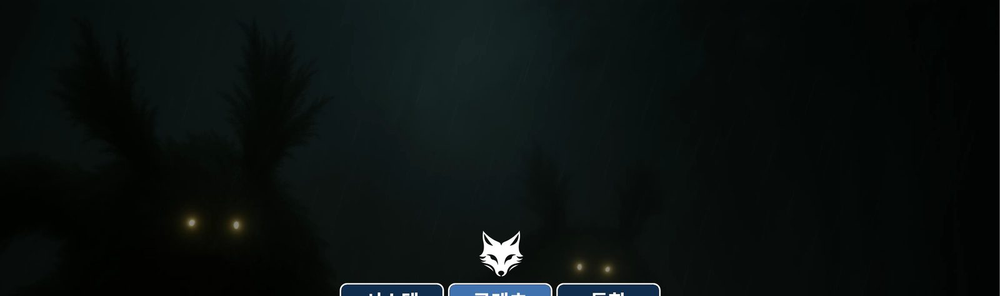
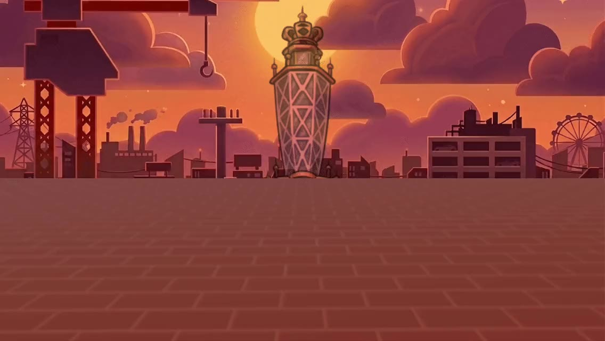
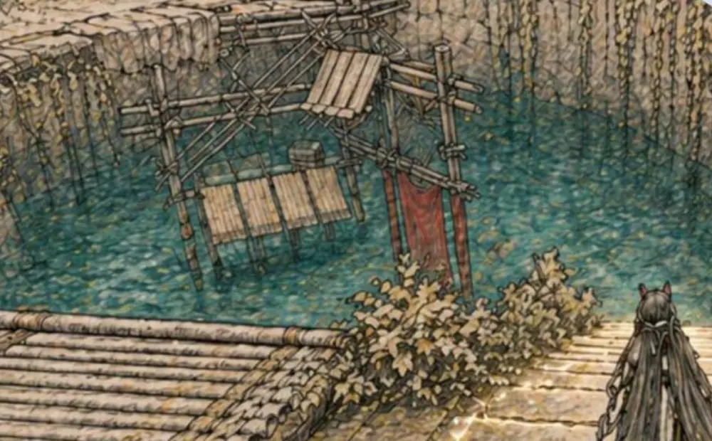
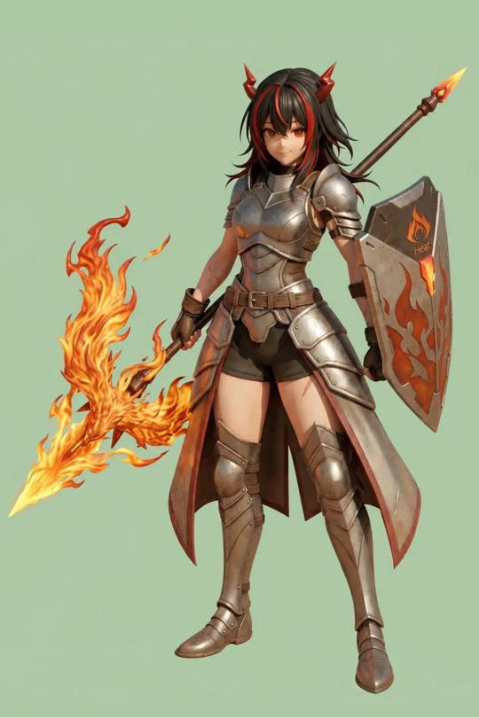

# index 개편 v4 — 3D 캐러셀 히어로 + 목차 구조 (구현 지시서)

> **작성: 2026-07-15 (Fable, 기획 세션). 구현: 다음 세션(Opus).**
> 레퍼런스: Pinterest "Voyage" 여행 사이트 히어로 — 5장의 카드가 3D 부채꼴로 펼쳐지고,
> 중앙 카드의 제목이 히어로 전체에 크게 얹히며, 화살표로 카드가 순환하는 구조.
> 이 문서는 그 문법을 이 포트폴리오에 맞게 번역한 **실행 사양**이다. 수치·마크업·JS는 그대로 옮겨도 되게 썼다.
> 단, **시각 확인이 필요한 지점(§2 이미지, §7 체크리스트)은 반드시 브라우저로 검증**할 것.

---

## 0. 요구사항 (사용자 원문 → 사양 번역)

| 사용자 요구 | 사양 |
|---|---|
| 카드 hover 시 반응 + 제목·짧은 설명 페이드인 | §4.4 — hover 시 카드가 살짝 펴지고(scale↑, rotateY↓) 카드 하단 메타(제목+한 줄)가 opacity 0→1 |
| "넘기면 파일이 넘어옴" | §5 — 화살표·측면 카드 클릭·드래그·←→ 키로 active 인덱스 순환, transform 전환 |
| 맨 위에 목차 (이력서/창작/역기획/제안/추가 링크) | §3.1 — sticky 목차 바, 앵커 점프 |
| 캐러셀 바로 아래 이력서 | §3 — 문서 순서: 목차 → 캐러셀 히어로 → `#resume` → 프로젝트 카드 3영역 → `#links` |
| 나머지는 그대로 | 프로젝트 페이지 5개·공통 셸·이력서 내용·카드 3영역 내용 **불변** |

**건드리지 말 것:** `projects/*.html` 전부, `assets/style.css`의 공통 셸(.site-bar/.proj-nav) 블록, 이력서 플레이스홀더 문안, 카드 5장의 문안·칩·accent.

## 1. 페이지 구조 (index.html 재배치)

```
<body class="home">
├── <nav class="toc-bar">          ← 신규. sticky 목차
├── <header class="cr-hero">       ← 신규. 3D 캐러셀 (기존 hero-home 대체)
├── <section id="resume">          ← 기존 그대로, 위치만 이동 (프로젝트 위로)
├── <section id="projects">        ← 기존 그대로. 3개 .group에 앵커 id만 추가
│     ├── .group#create   창작 게임 (2)
│     ├── .group#reverse  역기획 (2)
│     └── .group#proposal 제안 (1)
├── <section id="links">           ← 기존 그대로 ("다른 기록")
└── <footer class="foot">          ← 기존 그대로
```

- 기존 `<header class="hero-home">` 마크업은 **삭제**. 그 더미 문안("배현이라는 게임 기획자 / 신입의 포트폴리오")은
  캐러셀 히어로의 킥 라인(h1)으로 **원문 그대로 이동**한다(§3.2). style.css의 `.hero-home` 블록도 삭제(사용처 소멸).
- 앵커: `#resume`(기존) / `#create` `#reverse` `#proposal`(각 `.group` div에 id 추가) / `#links`(기존).
  전 앵커 대상에 `scroll-margin-top:68px` (목차 바 높이 + 여유).

## 2. 이미지 준비 (마크업보다 먼저)

캐러셀 카드는 **세로 2:3**. 기존 썸네일은 가로형이라 `object-fit:cover` 크롭으로 쓰되,
소스 폭이 부족한 2건은 전용 크롭을 만든다. **모든 크롭은 Read 도구로 결과를 눈으로 확인할 것.**

| 카드 | 소스 | 처리 | object-position |
|---|---|---|---|
| 여우숲 | `assets/img/foxforest/01.jpg` (1600×474) | 그대로 사용. 중앙 세로 슬라이스=여우 로고 부근. 어두운 무드가 정체성이므로 소프트해도 허용 | `center 55%` (로고·버튼이 보이게 조정) |
| 원쁠원 | `assets/img/onepluone/01.jpg` (1136×640) | 그대로 사용. 중앙 타워가 세로 피사체 | `center 30%` |
| 가마솥 SIGMA | `assets/img/hzd-quest/02.webp` | **전용 크롭 생성** → `assets/img/hzd-quest/carousel.jpg`. 우측의 기계(전신) 영역을 세로로 잘라낸다. 01.webp은 세로 슬라이스 소스폭 253px로 부적합 | `center` |
| 무릉 천정원 지하 | `assets/img/endfield-level/01.webp` (1000×620) | 그대로 사용. 수몰 구조물 중앙 | `55% center` |
| 헤스티 | `assets/img/hesti-character/05.webp` | **전용 크롭 생성** → `assets/img/hesti-character/carousel.jpg`. 좌측 캐릭터 전신을 세로로 | `center` |

크롭 절차 (sips만 사용, PIL 없음. **치수를 먼저 재고** 오프셋 계산):

```bash
# 1) 실측 (02.webp 표기 치수가 파일마다 다르므로 반드시 측정)
sips -g pixelWidth -g pixelHeight assets/img/hzd-quest/02.webp
# 2) png 변환 → 크롭 → jpeg 저장 (scratchpad 경유). sips -c <높이> <폭> --cropOffset <y> <x>
#    가마솥: 우측 기계 전신 (대략 우측 1/3, 상단 40%~하단). 크롭 후 Read로 확인, 오프셋 조정 반복
#    헤스티: 이전 세션에서 thumb.jpg를 만든 전례 있음 — 같은 소스에서 세로(≈500×710)로
# 3) jpeg 품질 68 (thumb.jpg 전례), 목표 ≤80KB
```

결과 이미지가 카드(최대 표시폭 ~272px, 레티나 544px)에서 뭉개지지 않는지 확인.

## 3. 마크업

### 3.1 목차 바 (`.toc-bar`)

```html
<nav class="toc-bar" aria-label="페이지 목차"><div class="toc-bar__in">
  <a class="toc-bar__brand" href="#top">배현 · <b>게임기획 포트폴리오</b></a>
  <div class="toc-bar__links">
    <a href="#resume">이력서</a>
    <a href="#create">창작 게임</a>
    <a href="#reverse">역기획</a>
    <a href="#proposal">제안</a>
    <a href="#links">추가 링크</a>
  </div>
</div></nav>
```

- 스타일은 프로젝트 페이지 nav 관례를 따른다: `position:sticky; top:0; z-index:50; height:52px;
  background:rgba(247,247,243,.93); backdrop-filter:blur(8px); border-bottom:1px solid var(--line)`.
  브랜드는 mono 13px 600, 링크는 13px `var(--muted)` → hover 시 `var(--ink)` + 밑줄 2px slate.
- **모바일에서 숨기지 않는다**(프로젝트 페이지와 다른 점 — 여기선 목차가 핵심 기능).
  `.toc-bar__links{overflow-x:auto; white-space:nowrap}` 로 가로 스크롤 허용, 스크롤바 숨김.

### 3.2 캐러셀 히어로 (`.cr-hero`)

```html
<header class="cr-hero" id="top">
  <div class="cr-bgwrap" aria-hidden="true">
    
    
  </div>
  <h1 class="cr-kick">배현이라는 게임 기획자 · 신입의 포트폴리오</h1><!-- 더미 — 문안 확정 시 교체 -->

  <div class="cr-stage" role="region" aria-roledescription="carousel" aria-label="프로젝트 하이라이트">
    <!-- 카드 5장. 순서 = 기존 정식 순서. data-*가 중앙 타이틀의 데이터 소스 -->
    <article class="cr-card" data-title="여우숲" data-tagline="공포·레이싱·퍼즐을 하나의 루프로" data-chip="창작 · UNITY 3D">
      <a href="projects/foxforest.html">
        
        <span class="cr-card__meta"><b>여우숲</b><span>공포·레이싱·퍼즐을 하나의 루프로</span></span>
      </a>
    </article>
    <article class="cr-card" data-title="원쁠원" data-tagline="1인 2역으로 싸우는 보스전" data-chip="창작 · MSW">
      <a href="projects/onepluone.html">
        
        <span class="cr-card__meta"><b>원쁠원</b><span>1인 2역으로 싸우는 보스전</span></span>
      </a>
    </article>
    <article class="cr-card" data-title="가마솥 SIGMA" data-tagline="이야기가 목표·동선·전투가 되는 과정" data-chip="역기획 · 퀘스트">
      <a href="projects/hzd-quest.html">
        
        <span class="cr-card__meta"><b>가마솥 SIGMA</b><span>이야기가 목표·동선·전투가 되는 과정</span></span>
      </a>
    </article>
    <article class="cr-card" data-title="무릉 천정원 지하" data-tagline="물 하나로 공간을 잠그고 연다" data-chip="역기획 · 레벨">
      <a href="projects/endfield-level.html">
        
        <span class="cr-card__meta"><b>무릉 천정원 지하</b><span>물 하나로 공간을 잠그고 연다</span></span>
      </a>
    </article>
    <article class="cr-card" data-title="헤스티" data-tagline="적의 공격을 파티의 자원으로" data-chip="제안 · 캐릭터">
      <a href="projects/hesti-character.html">
        
        <span class="cr-card__meta"><b>헤스티</b><span>적의 공격을 파티의 자원으로</span></span>
      </a>
    </article>
  </div>

  <div class="cr-title" aria-live="polite" aria-atomic="true">
    <span class="cr-chip"></span>
    <div class="cr-big"></div>
    <p class="cr-tag"></p>
  </div>

  <button class="cr-arw cr-arw--prev" aria-label="이전 프로젝트">‹</button>
  <button class="cr-arw cr-arw--next" aria-label="다음 프로젝트">›</button>
</header>
```

태그라인 5개는 각 페이지 자기 언어에서 뽑은 **초안**이다(헤스티는 그 페이지 h1 그대로). 사용자 검수 목록에 올릴 것.

## 4. CSS (style.css의 index 구역에 추가)

### 4.1 히어로 골격

```css
.cr-hero{position:relative; background:#232B34; color:#EEF1F4; overflow:hidden;
  height:clamp(560px, 82vh, 720px); border-top:none}
.cr-hero + section{border-top:none}
.cr-bgwrap{position:absolute; inset:0}
.cr-bg{position:absolute; inset:0; width:100%; height:100%; object-fit:cover;
  filter:blur(28px) brightness(.42) saturate(.85); transform:scale(1.15);
  transition:opacity .5s ease}
.cr-bgwrap::after{content:""; position:absolute; inset:0;
  background:linear-gradient(180deg, rgba(35,43,52,.35), rgba(35,43,52,.88) 92%)}
.cr-kick{position:relative; z-index:6; text-align:center; margin:0; padding-top:34px;
  font-family:var(--font-mono); font-size:12px; font-weight:600;
  letter-spacing:.2em; color:#A8BACB}
```

### 4.2 스테이지와 카드 (핵심 수치)

```css
.cr-stage{position:absolute; inset:0; perspective:1500px; --crw:clamp(210px, 21.5vw, 272px)}
.cr-card{position:absolute; left:50%; top:50%; width:var(--crw); aspect-ratio:2/3;
  border-radius:12px; overflow:hidden; box-shadow:0 22px 60px rgba(0,0,0,.45);
  transition:transform .55s cubic-bezier(.22,.61,.36,1), filter .55s, opacity .4s}
.cr-card a{display:block; width:100%; height:100%; color:inherit; text-decoration:none}
.cr-card img{width:100%; height:100%; object-fit:cover; display:block}

/* 위치 매트릭스 — JS가 data-pos(-2..2)를 부여 */
.cr-card[data-pos="0"] {transform:translate(-50%,-50%) translateX(0) rotateY(0) scale(1); z-index:5}
.cr-card[data-pos="1"] {transform:translate(-50%,-50%) translateX(calc(var(--crw)*1.05)) rotateY(-16deg) scale(.88); filter:brightness(.78); z-index:4}
.cr-card[data-pos="-1"]{transform:translate(-50%,-50%) translateX(calc(var(--crw)*-1.05)) rotateY(16deg) scale(.88); filter:brightness(.78); z-index:4}
.cr-card[data-pos="2"] {transform:translate(-50%,-50%) translateX(calc(var(--crw)*2.0)) rotateY(-27deg) scale(.78); filter:brightness(.55); z-index:3}
.cr-card[data-pos="-2"]{transform:translate(-50%,-50%) translateX(calc(var(--crw)*-2.0)) rotateY(27deg) scale(.78); filter:brightness(.55); z-index:3}
```

### 4.3 중앙 타이틀·화살표

```css
.cr-title{position:absolute; left:50%; top:50%; transform:translate(-50%,-50%);
  z-index:6; text-align:center; pointer-events:none; width:min(90vw, 800px)}
.cr-chip{font-family:var(--font-mono); font-size:11.5px; font-weight:600; letter-spacing:.14em;
  text-transform:uppercase; color:#E6EBEF; border:1px solid rgba(255,255,255,.35);
  background:rgba(35,43,52,.45); border-radius:999px; padding:5px 14px; display:inline-block}
.cr-big{font-family:var(--font-title); font-weight:700; font-size:clamp(32px,5.2vw,58px);
  line-height:1.15; margin:14px 0 10px; text-shadow:0 4px 42px rgba(0,0,0,.55)}
.cr-tag{margin:0; font-size:14.5px; color:#C4CCD4; text-shadow:0 2px 18px rgba(0,0,0,.5)}
.cr-arw{position:absolute; top:50%; transform:translateY(-50%); z-index:7;
  width:46px; height:64px; border-radius:8px; cursor:pointer; font-size:30px; line-height:1;
  color:#EEF1F4; background:rgba(255,255,255,.07); border:1px solid rgba(255,255,255,.22)}
.cr-arw:hover{background:rgba(255,255,255,.16)}
.cr-arw--prev{left:clamp(8px,3vw,48px)} .cr-arw--next{right:clamp(8px,3vw,48px)}
```

### 4.4 hover 반응 + 메타 페이드인 (요구 1)

```css
.cr-card__meta{position:absolute; left:0; right:0; bottom:0; z-index:2; padding:44px 16px 14px;
  background:linear-gradient(transparent, rgba(10,14,18,.82));
  opacity:0; transition:opacity .3s ease; display:flex; flex-direction:column; gap:2px}
.cr-card__meta b{font-family:var(--font-title); font-size:16px; color:#fff}
.cr-card__meta span{font-size:12px; color:#C4CCD4; line-height:1.5}
.cr-card:hover .cr-card__meta, .cr-card:focus-within .cr-card__meta{opacity:1}

/* hover 시 측면 카드가 카메라 쪽으로 살짝 펴진다 — 위치별로 명시 (특정도 동일, 반드시 매트릭스 뒤에) */
.cr-card[data-pos="1"]:hover {transform:translate(-50%,-50%) translateX(calc(var(--crw)*1.05)) rotateY(-10deg) scale(.92); filter:brightness(.95)}
.cr-card[data-pos="-1"]:hover{transform:translate(-50%,-50%) translateX(calc(var(--crw)*-1.05)) rotateY(10deg) scale(.92); filter:brightness(.95)}
.cr-card[data-pos="2"]:hover {transform:translate(-50%,-50%) translateX(calc(var(--crw)*2.0)) rotateY(-19deg) scale(.82); filter:brightness(.85)}
.cr-card[data-pos="-2"]:hover{transform:translate(-50%,-50%) translateX(calc(var(--crw)*-2.0)) rotateY(19deg) scale(.82); filter:brightness(.85)}
.cr-card[data-pos="0"]:hover {transform:translate(-50%,-50%) translateY(-6px) scale(1.015)}
```

### 4.5 모바일(≤720px) — 평면 모드

3D 부채꼴 대신 중앙+양옆 살짝(회전 없음). ±2는 숨김. 스와이프(§5)가 주 조작.

```css
@media(max-width:720px){
  .cr-hero{height:clamp(480px, 78vh, 620px)}
  .cr-stage{--crw:62vw; perspective:none}
  .cr-card[data-pos="1"], .cr-card[data-pos="-1"]{transform:translate(-50%,-50%) translateX(calc(var(--crw)*var(--dir,1)*0.86)) scale(.9); filter:brightness(.65)}
  /* --dir 없이 그냥 2개 규칙으로 각각 써도 된다. rotateY 금지 */
  .cr-card[data-pos="2"], .cr-card[data-pos="-2"]{opacity:0; pointer-events:none}
  .cr-big{font-size:clamp(26px,8vw,34px)}
  .cr-arw{width:38px; height:52px; font-size:24px}
  .cr-card__meta{opacity:1}   /* 터치엔 hover가 없다 — 항상 표시 */
}
```

### 4.6 축소 동작·무JS 폴백

```css
@media(prefers-reduced-motion:reduce){
  .cr-card, .cr-bg{transition:none}
}
/* JS 미실행(파싱 실패 등) 시: 카드가 data-pos를 못 받아도 전부 보이게 */
.cr-stage:not(.is-ready) .cr-card{position:static; width:min(86vw,300px); margin:12px auto;
  transform:none}
.cr-stage:not(.is-ready){position:relative; inset:auto; padding:24px 0}
.cr-stage:not(.is-ready) ~ .cr-title{display:none}
```

**함정 경고(이 저장소에서 이미 겪음):** `.cr-card[data-pos]`와 `:hover` 변형은 특정도가 같아
**선언 순서가 승부를 가른다**. hover 블록은 반드시 위치 매트릭스 **뒤에** 둘 것.
(전례: `.cards--single`이 `.cards .card`보다 앞에 있어서 무효였던 버그 — style.css 주석 참조.)

## 5. JS (index.html 하단 인라인 `<script>`, 의존성 0)

프로젝트 페이지들이 각자 인라인 스크립트를 소유하는 관례를 따른다. style.css엔 JS 없음.

```js
(function(){
  const stage = document.querySelector('.cr-stage');
  if (!stage) return;
  const cards = [...stage.querySelectorAll('.cr-card')];
  const N = cards.length;
  const big = document.querySelector('.cr-big');
  const tag = document.querySelector('.cr-tag');
  const chip = document.querySelector('.cr-chip');
  const bgs = [...document.querySelectorAll('.cr-bg')];
  let act = 0, bgOn = 0, downX = null, dragged = false;

  function render(){
    cards.forEach((c, i) => {
      let d = (i - act + N) % N;
      if (d > N / 2) d -= N;                       // d ∈ {-2..2}
      c.dataset.pos = d;
      c.querySelector('a').tabIndex = d === 0 ? 0 : -1;   // 탭 순서는 중앙만
    });
    const a = cards[act];
    chip.textContent = a.dataset.chip;
    big.textContent  = a.dataset.title;
    tag.textContent  = a.dataset.tagline;
    const src = a.querySelector('img').currentSrc || a.querySelector('img').src;
    const nxt = bgs[1 - bgOn];
    if (bgs[bgOn].src !== src) {
      nxt.src = src; nxt.style.opacity = 1; bgs[bgOn].style.opacity = 0; bgOn = 1 - bgOn;
    }
  }
  const go = d => { act = (act + d + N) % N; render(); };

  document.querySelector('.cr-arw--prev').addEventListener('click', () => go(-1));
  document.querySelector('.cr-arw--next').addEventListener('click', () => go(1));

  cards.forEach((c, i) => c.addEventListener('click', e => {
    if (dragged) { e.preventDefault(); return; }          // 드래그 직후 오클릭 방지
    if (i !== act) { e.preventDefault(); act = i; render(); } // 측면 클릭 = 중앙으로
  }));                                                    // 중앙 클릭 = 링크 그대로

  document.querySelector('.cr-hero').addEventListener('keydown', e => {
    if (e.key === 'ArrowLeft')  { e.preventDefault(); go(-1); }
    if (e.key === 'ArrowRight') { e.preventDefault(); go(1); }
  });

  stage.addEventListener('pointerdown', e => { downX = e.clientX; dragged = false; });
  addEventListener('pointerup', e => {
    if (downX == null) return;
    const dx = e.clientX - downX; downX = null;
    if (Math.abs(dx) > 40) { dragged = true; go(dx < 0 ? 1 : -1); setTimeout(() => dragged = false, 80); }
  });

  stage.classList.add('is-ready');
  render();
})();
```

동작 계약: 무한 순환(4→0), 측면 카드 클릭은 그 카드를 중앙으로(이동만), 중앙 카드 클릭은 페이지 이동,
드래그 40px 이상은 넘김이며 직후 클릭 1회 무시, 타이틀·칩·태그라인·배경 에코가 함께 전환.

## 6. 접근성·성능 요건

- 카드 5장 전부 실제 `<a>` — JS 실패해도 5개 링크는 존재(§4.6 폴백이 이를 보이게 함).
- `.cr-title`은 `aria-live="polite"` — 넘길 때 스크린리더가 현재 프로젝트를 읽는다.
- 화살표는 `<button aria-label>`. 포커스 링은 기존 전역 `:focus-visible` 규칙이 처리.
- 이미지: 카드 5장 `loading` 생략(히어로라 즉시), `.cr-bg`는 카드와 같은 파일 재사용이라 추가 비용 0.
- 애니메이션은 transform/opacity/filter만. 레이아웃 속성 전환 금지. blur는 정적(전환은 opacity만).
- 추가 JS ≤ 3KB. 외부 라이브러리 금지.
- CLS 방지: `.cr-hero` 높이가 고정(clamp)이므로 로드 중 점프 없음.

## 7. 검증 체크리스트 (Opus 세션이 순서대로)

기존 도구 재사용: 서버는 `.claude/launch.json`의 `portfolio`(python http.server 4173).
**주의: 브라우저 페인 스크린샷은 스크롤된 영역을 못 잡는다(이 저장소에서 확인된 도구 한계).**
섹션 검증은 이전 세션의 `__iso` 기법(위쪽 형제 display:none 후 최상단 캡처)을 쓸 것.
`html{scroll-behavior:smooth}` 때문에 `computer scroll`이 타임아웃될 수 있다 — JS `scrollTo({behavior:'instant'})` 사용.

1. 크롭 2건(§2) 생성 → Read로 눈 확인 → 카드에서 재확인.
2. 데스크톱 1280px: 부채꼴 5장 렌더, 화살표 양방향 순환(0→4→0 랩 포함), 타이틀·칩·배경 동시 전환.
3. 측면 카드 클릭 → 중앙 이동(페이지 이동 아님). 중앙 카드 클릭 → 해당 프로젝트 페이지로 이동.
4. hover: 측면 카드 computed opacity로 `.cr-card__meta` 0→1 확인, transform 변화 확인.
5. 키보드: ←/→ 순환, Tab이 중앙 카드에만 닿음, Enter로 이동.
6. 목차 5개 앵커 점프가 목차 바에 안 가리는지(scroll-margin) — resume/create/reverse/proposal/links 전부.
7. 375px: 평면 모드(rotateY 없음), ±2 숨김, 스와이프 넘김, 메타 상시 표시, **가로 스크롤 0**(기존 넘침 프로브 스크립트 재사용).
8. 콘솔 에러 0, 로컬 참조 전수 HTTP 200(기존 check_links류 스크립트에 새 crop 2건 포함됨을 확인).
9. no-JS 스모크: `<script>` 임시 주석 후 카드 5장이 세로로 전부 보이고 링크 동작 → 원복.
10. README.md 구조 트리에 carousel.jpg 2건·index 신규 구역 반영, CLAUDE.md 남은 일 갱신.

## 8. 사용자 검수 대기 항목 (구현 후 보고에 포함)

- 태그라인 5개 문안(§3.2 초안) — 특히 원쁠원 "1인 2역으로 싸우는 보스전".
- 캐러셀 시작 카드(현재 여우숲=0). 다른 카드로 시작하고 싶은지.
- 킥 라인 더미 문안 유지 여부(사용자 지정 더미를 그대로 옮김).
- (이월) 이력서 전화번호 노출 여부 — 아직 답 없음.
- (이월) 이력서 `{{...}}` 4곳 콘텐츠.
